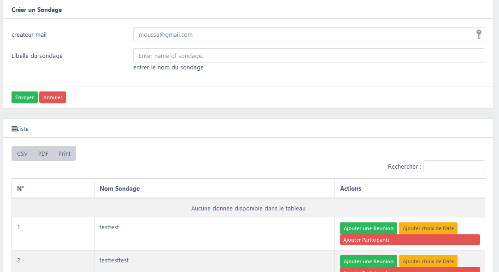

# Compte rendu du projet frontend Doodle

Apres avoir developpé notre backend, nous avons commencer à developper le frontend de notre application.

## choix de technologie
nous avons choisir le framework VUE JS pour developper notre frontend. Notre choix s'est porté sur ce framework parce que dans un premier temps elle est sipmle à manipuler et nous avons eu à utiliser ce framework lors de notre projet Pro
## Developpement
l'architecture de notre projet frontend a été generer avec VUE CLI https://github.com/vuejs/vue-cli
## Installation
git clone https://github.com/issa7/FrontendDoodle.git
### installation des package 
npm install

### serveur de developpement
npm run dev 
sur le navigateur qui est le client : http://localhost:8081/

# Fonctionnalités developpe à ce jour 
### consulter la liste des sondage 
ici nous pouvont consulter la liste des sondage
### créer un createur
### créer une reunion 
### crééer sondage
### ajouter des partcipants au sondage créer par le createur
### ajouter des dates au sondage à choisir par les participants
pour creer un sondage, le createur doit se connecter, si le connexion a reussir alors il est rediregé vers le formulaire de creation de sondage. une fois créer alors on peut ajouter une reunion au sondage, aussi on peut ajouter des choix de date au sondage et enfin on peut ajouter des participants au sondage image ci dessous

# les ecrans qui restent à implementer 

# authors
## Issa Keita
## Seydou Bakayoko
